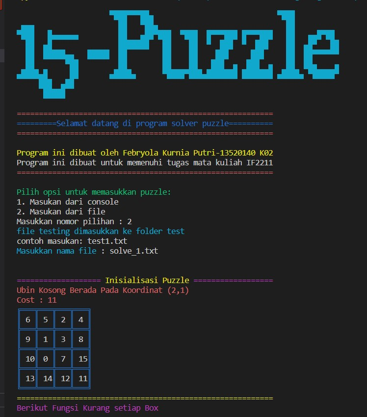

# Implementasi Game 15-Puzzle dengan Algoritma Branch and Bound
Tugas Kecil 3 IF2211 Strategi Algoritma Semester II Tahun 2021/2022

Menyelesaikan Persoalan 15-Puzzle Dengan Menggunakan Algoritma Branch and Bound

## Table of Contents
* [General Information](#general-information)
* [Requirement](#requirement)
* [Setup](#setup)
* [Organogram](#organogram)
* [Message](#message)
* [Contact](#contact)

## General Information
  Program Game 15-Puzzle ini ditulis dengan menggunakan bahasa python yang bertujuan untuk memecahkan persoalan 15-puzzle dengan menggunakan algoritma branch and bound. Awalnya puzzle
  akan memiliki susunan yang tidak sesuai dengan goalnya. Program ini dibuat dengan memindahkan
  ubin kosong (angka 0) sehingga pada akhirnya susunan ubin akan mencapai goal. Perpindahan yang
  dilakukan menggunakan algoritma branch and bound dengan pendekatan least cost search di mana
  simpul berikutnya ditentukan dari yang memiliki cost terkecil.
## Requirement
1. Python 3 atau versi lainnya

## Setup
Program dapat dicompile di terminal teks editor seperti vs code dan akan menampilkan contoh output seperti berikut ini:

Untuk dapat menjalankan program ini sangat mudah:
1. Lakukan compile terhadap file main.py yang terdapat pada folder src
2. Masukkan pilihan inputan puzzle yang diinginkan
3. Jika memilih inputan dari console, maka pilih angka 1 dan masukkan matriks yang
   diminta sesuai contoh
4. Jika memilih inputan dari file, maka pastikan file sudah terdapat pada folder test
   dan masukkan nama file yang ingin di test
   dan ekstension python sudah dapat dijalankan
5. Klik enter, lalu program dapat dijalankan
## Organogram
1. doc = berisikan file laporan
2. test = berisi file.txt yang berisi data uji puzzle
3. readme
4. src
 - functionFile.py = berisi fungsi-fungsi branch and bound dan pengelolaan file dan console yang dibutuhkan program
 - puzzle15.py = berisi kelas puzzle dan node
 - main.py = program utama
 
## Message
yey tucil stima terakhir
Buat kakak2 asisten yang baca readme ini semangat kuliahnya yahh!!
## Contact
This program was made by Febryola Kurnia Putri (13520140).
email : 13520140@std.stei.itb.ac.id
